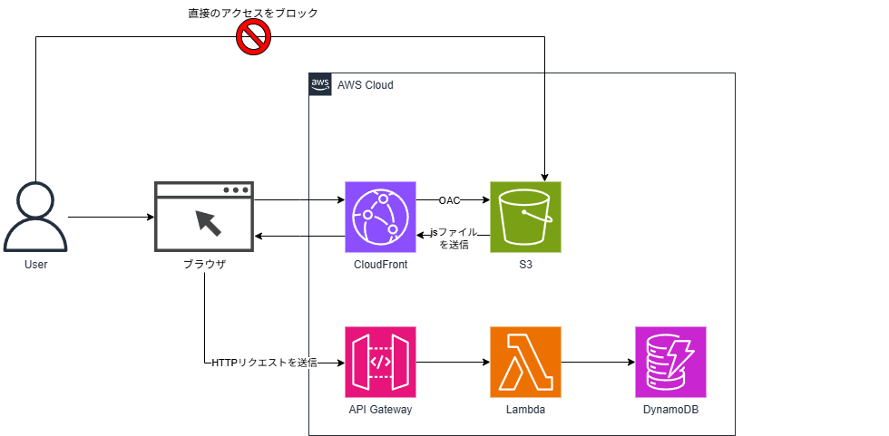
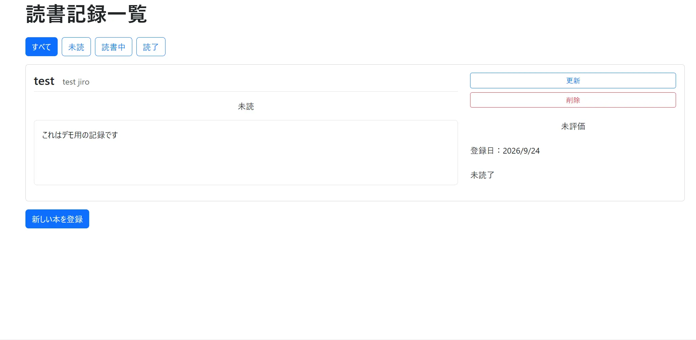
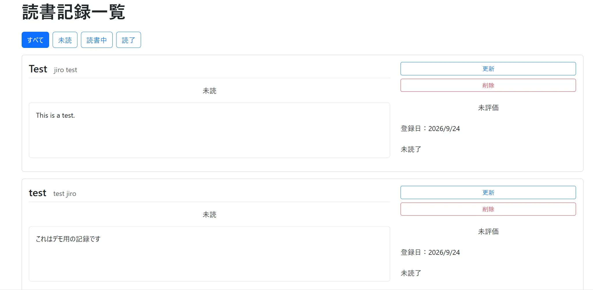

# vue-go-reading-log

## 概要

読んだ本の情報や感想を記録・管理できる読書記録アプリです。
本のタイトル・著者・読書ステータス（未読／読書中／読了）・評価・メモを登録でき、ステータスごとの絞り込みにも対応しています。

Go による基本的な CRUD API の実装と、Vue.js によるフロントエンド開発の学習を主な目的として制作しました。
あわせて AWS 上へのデプロイまでを一貫して行い、フロントエンド・バックエンド・インフラを含めたフルスタックでのアプリ開発に取り組みました。

フロントエンドは Vue.js、バックエンドは Go、インフラは AWS で構成した、フルサーバーレスの Web アプリケーションです。
インフラはすべて Terraform でコード管理しています。

## 使用技術

### フロントエンド

| 名称 | バージョン | 用途 |
|---|---|---|
| Vue.js | 3.5.42 | SPA のフロントエンドフレームワーク |
| Vue Router | 5.3.1 | 一覧・新規作成・更新ページのルーティング |
| Bootstrap | 5.3.8 | UI のスタイリング（カードレイアウト等） |
| Vite | 8.3.0 | 開発サーバーおよびビルドツール |

### バックエンド

| 名称 | バージョン | 用途 |
|---|---|---|
| Go | 1.26.5 | Lambda 上で動作する API の実装言語 |
| aws-lambda-go | 1.55.0 | Lambda ハンドラーと API Gateway イベントの型定義 |
| AWS SDK for Go v2（DynamoDB） | 1.65.1 | DynamoDB への CRUD 操作 |

### インフラ

| 名称 | バージョン | 用途 |
|---|---|---|
| Terraform | 1.15.3 | インフラのコード管理（IaC） |
| AWS Provider | 6.0.0 | Terraform から AWS リソースを操作 |
| Archive Provider | 2.8.1 | Go バイナリを zip 化して Lambda にデプロイ |
| Amazon S3 | - | フロントエンドの静的ファイル格納 |
| Amazon CloudFront | - | フロントエンド配信、OAC による S3 へのアクセス制御 |
| Amazon API Gateway | HTTP API | API のエンドポイント提供、CORS 制御 |
| AWS Lambda | provided.al2023 | Go バイナリによる API 処理 |
| Amazon DynamoDB | - | 読書記録の保存、GSI によるステータス絞り込み |
| AWS IAM | - | 最小権限の Lambda 実行ロール |

## アーキテクチャ

本アプリは、フロントエンドの配信経路と API の経路を分離したフルサーバーレス構成です。

### フロントエンドの配信経路

ユーザーのブラウザは CloudFront にアクセスし、S3 に格納された Vue.js のビルド成果物（HTML / CSS / JavaScript）を取得します。
S3 バケットはパブリックアクセスをブロックし、OAC（Origin Access Control）によって CloudFront からのアクセスのみを許可しています。
これにより、すべてのアクセスを CloudFront に一本化し、HTTPS の強制やキャッシュを確実に適用しています。
また、バケットポリシーでは CloudFront に読み取り（`s3:GetObject`）のみを許可し、書き込み権限は付与していません。

### API の経路

ブラウザ上で動作する Vue.js が API Gateway に HTTP リクエストを送信し、API Gateway はルートに応じて Lambda を呼び出します。
Lambda は Go で実装しており、DynamoDB に対してデータの取得・登録・更新・削除を行い、結果をレスポンスとして返します。

静的なフロントエンドは S3 + CloudFront、動的な処理は Lambda と役割ごとにサービスを分けることで、
常時起動のサーバーを持たず、リクエストが発生した分だけ料金がかかる低コストな構成を実現しています。

## 主な機能

| 機能 | 内容 |
|---|---|
| 読書記録の作成 | タイトル・著者・メモを入力して登録（登録日は自動で記録） |
| 読書記録の一覧表示 | 登録した記録をカード形式で一覧表示 |
| 読書記録の更新 | タイトル・著者・ステータス・評価・メモを編集 |
| 読書記録の削除 | 不要になった記録を削除 |
| ステータスによる絞り込み | 未読／読書中／読了で一覧を絞り込み（DynamoDB の GSI を利用） |
| 評価の星表示 | 1〜5 の評価を一覧で ★★★☆☆ のように表示 |
| 読了日の自動記録 | ステータスを「読了」にすると読了日を自動で記録し、他のステータスに戻すとクリア |

## デモ

### 読書記録の作成

### 読書記録の更新（読了日の自動記録）

### ステータスによる絞り込み・削除

## 工夫した点・学んだ点

### Gin から Lambda ネイティブ実装への書き換え

当初はローカルで Gin を使って REST API を実装していました。
AWS Lambda へのデプロイにあたり、アダプタを介して Gin をそのまま動かす方法も検討しましたが、
Gin は常駐サーバーを前提とした設計であり、リクエストごとに起動する Lambda のモデルとは思想が異なります。
そこで aws-lambda-go を用いた Lambda ネイティブな実装に書き換え、
API Gateway のルート情報（RouteKey）をもとに処理を振り分ける形に変更しました。
DynamoDB を操作するロジックはそのまま流用し、リクエストの受け取りとレスポンスの返却部分のみを Lambda の形式に置き換えています。

### ステータス絞り込みに GSI + Query を採用

ステータスによる絞り込みは、Scan + Filter ではなく、Status をパーティションキーとする GSI に対する Query で実装しました。
Scan はテーブルの全アイテムを読み込んでから条件に合わないものを除外するため、
データ件数が増えるほど読み込み量（コスト・応答時間）が増加します。
一方、GSI に対する Query は該当するステータスのデータのみを直接読み込むため、
テーブルの規模に関わらず必要最小限の読み込みで済みます。
DynamoDB の「アクセスパターンに合わせてキーを設計する」という考え方に沿い、
id による取得はテーブルのパーティションキー、ステータスによる絞り込みは GSI と、用途ごとにキーを使い分けています。

### Vue Router による画面分割と SPA 特有の配信対応

Vue Router を用いて、一覧・新規作成・更新の 3 ページに画面を分割しました。
SPA では実際に存在する HTML は index.html のみのため、`/edit/{id}` のような URL に直接アクセスすると
S3 に該当ファイルが存在せずエラーになります。
そこで CloudFront のカスタムエラーレスポンスで 403 / 404 の際に index.html を返すよう設定し、
URL を直接開いた場合でも Vue Router が正しいページを表示できるようにしました。

### デプロイ構成を見据えた Bootstrap の導入

画面の見やすさ向上のため Bootstrap を導入しました。
導入にあたっては、CDN から読み込むのではなく npm でインストールしてビルドに含める方法を選択しています。
最終的に S3 + CloudFront で配信する構成のため、外部 CDN に依存せず、必要なファイルをすべて自身の S3 から配信できるようにしました。
